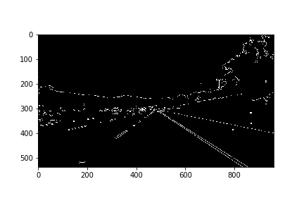
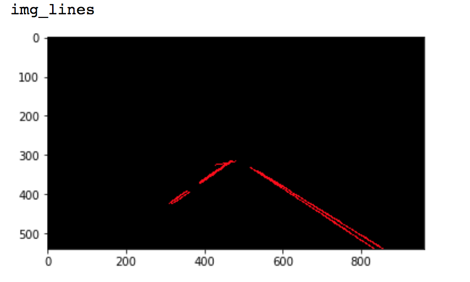
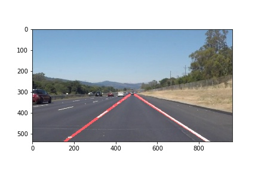

# **Finding Lane Lines on the Road** 

---
#Finding Lane Lines on the Road

This is the first project from Udacity Self-driving Car Nanodegree.

Goal
----
Detect lane lines.
Input: video from camera mounted on top of a car 
Output: annotated video 
Tools: color selection, region of interest selection, grayscaling, Gaussian smoothing, Canny Edge Detection and Hough Tranform line detection

Result video
----
Solid Yellow Left:  https://youtu.be/f_QvD_0OIc4

Solid White Right: https://youtu.be/LItjM45d9PY

Files
-----
P1.ipynb  : implementation

Instruction
----------
source activate carnd-term1
jupyter notebook

### Pipeline

**Finding Lane Lines on the Road**

Summary of my implementation:

Step 1.RGB to grayscale, apply Gaussian smoothing to remove noise and easier to find edge: ouput img_blur
  

Step 2. Canny edge  

Step 3.Use cv2.fillPoly to ignore everything outside region of interst, input: img_edges, output: img_edges_masked

Step 4. Hough transform to detect lines in an image, input : img_edges_masked, output: img_lines

Step 5. Extrapolate line segments, superimpose on the original image, output as final result

### Details on draw_two_lines() function

**Input**

all the output lines from hough line detection

**Parametesr**

set a min and max slope to identify outliers 

**Steps**

&nbsp;

    loop through all the lines 
    
        Positive slopes belong to left lines, negative slope belong to right lines.

        Find slope (m) and bias (b) for each line
    
        if the line is not an outlier:
    
            store the line parameters (m, b) in the left line or right line parameter array 
        
    find the mean value for m, b for left and right lines 

    Use mean m, b values to find the two end points for each of the left line and right line

### 2. Identify potential shortcomings with your current pipeline

One shortcoming is that it fails for the challenging case, where the lane lines are curved.  
The current hough line function only find staight edges and extrapolate it. 

### 3. Suggest possible improvements to your pipeline

There are two many hand tuned parameters, such as the ones for region of interest masking, Canny edge detector, and hough line detection. This make the pipeline not robust. A potential improvement is to use machine learning to learn these parameters.
